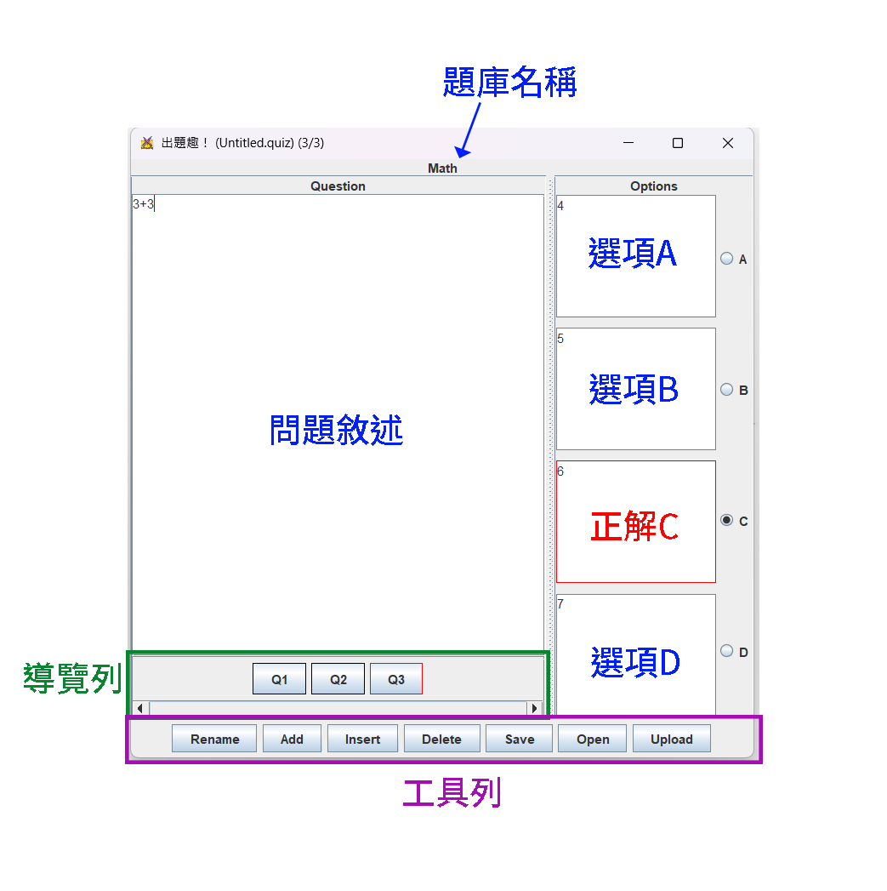
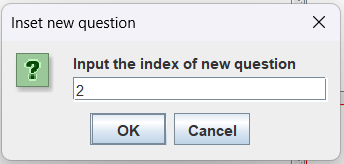

# 出題趣！

《出題趣！》是《刷題趣！》專用的出題工具，讓你能自己設計題目。透過《出題趣！》，你可以建立一個屬於你自己的題庫。每個題庫包含數道題目；每道題目包含了問題敘述、四個選項和一個正解。

寫好題庫後，你可以下載到你的電腦，之後便能在單人模式中選擇該題庫練習，和分享給你的同學；亦可上傳題庫到伺服器，在多人模式遊玩這個題庫。

《出題趣！》的介面如下，這個頁面將指導你如何使用《出題趣！》。

## 題目

左側的文字框可以輸入問題敘述。右側的4個文字框分別是選項A、B、C、D，其中以紅色框起來的是正解選項。透過點選選項右側的圓形按鈕，你可以選擇正解是哪個選項。

## 導覽列

透過導覽列你可以導覽到其他題目並進行編輯，只要點擊你想要導覽的題號即可。例如Q2按鈕會導覽至第二題，讓你可以編輯第二題的題目。正在編輯的題目題號會以紅色框框顯示。

## 工具列

在最下方有一排按鈕，分別是
- Rename
- Add
- Insert
- Delete
- Save
- Open
- Upload

### Rename

命名題庫

### Add

新增一道新題目放在題庫的最後面，並導覽至該題目進行編輯

### Insert

在題庫中間插入一道新的第X題題目，並導覽至該題目進行編輯。按下Insert鈕會跳出一個視窗讓你選擇要插入至第幾題。以下圖為例會插入一個新題目作為第二題

### Delete

刪除正在編輯的題目

### Save

儲存題庫

### Open

開啟其他題庫

### Upload

上傳題庫到指定的伺服器。**所有的題目必須完整填寫才能上傳**，包含題目敘述和四個選項不能留空白